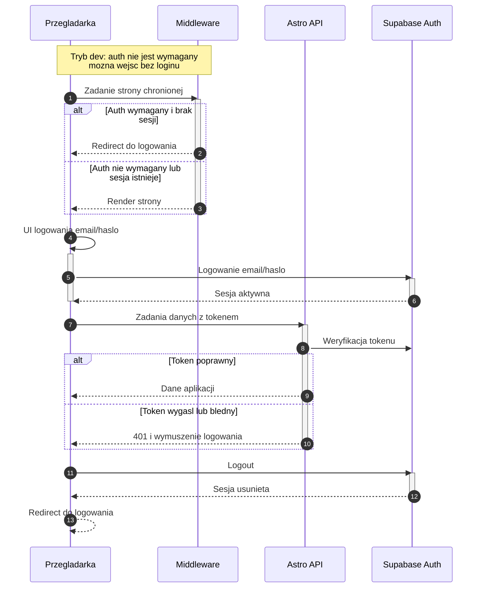

<authentication_analysis>
## Analiza przeplywow autentykacji (email/haslo, MVP)

### 1) Przepływy autentykacji z PRD i auth-spec

- **Logowanie email/haslo (MVP)**:
  - Wejście na `/login`
  - Podanie email i hasla
  - Zatwierdzenie logowania w Supabase Auth
  - Przejscie do aplikacji (`/`), a przy braku profilu/zespolu do `/setup`

- **Wylogowanie (US-001)**:
  - Kliknięcie `Logout`
  - `supabase.auth.signOut()`
  - Przekierowanie do `/login`

- **Ochrona tras**:
  - Gdy `PUBLIC_AUTH_REQUIRED=true` i brak sesji
    - redirect do `/login` (docelowo SSR + guard klientowy)
  - Gdy `PUBLIC_AUTH_REQUIRED=false` (tryb dev)
    - dostęp bez logowania jest możliwy, login nadal dostępny

### 2) Aktorzy i interakcje

- **Przeglądarka**: nawigacja, UI React, przechowywanie sesji Supabase.
- **Middleware**: (docelowo) odczyt sesji z cookies i decyzja o redirect.
- **Astro API**: endpointy domenowe wymagające tokenu (Authorization Bearer).
- **Supabase Auth**: logowanie email/haslo, sesja i odswiezanie tokenow.

### 3) Tokeny i odświeżanie

- `AuthProvider` pobiera sesję (`getSession`) i nasłuchuje zmian.
- `useApiClient` dołącza `Authorization: Bearer <accessToken>`.
- Przy wygaśnięciu tokenu:
  - Supabase odświeża token, a `onAuthStateChange` aktualizuje stan
  - Albo API zwraca 401 i UI wymusza ponowne logowanie

### 4) Opis kroków autentykacji (skrót)

- Wejście na trasę chronioną → weryfikacja sesji (SSR docelowo + guard).
- Brak sesji → redirect do `/login`.
- Wyslanie formularza logowania → Supabase Auth weryfikuje email/haslo.
- Sukces → Supabase zapisuje sesje; React odczytuje sesje i przechodzi do app.
- Bootstrap profilu/zespołu → ewentualny redirect do `/setup`.
- Logout → czyszczenie sesji i redirect do `/login`.
</authentication_analysis>

<mermaid_diagram>

</mermaid_diagram>

