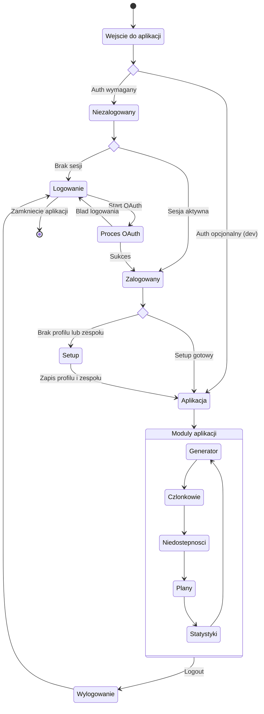

<user_journey_analysis>
## Analiza podróży użytkownika (logowanie i dostęp, MVP)

### 1) Ścieżki użytkownika z PRD i auth-spec

- Wejście do aplikacji jako niezalogowany:
  - Jeśli auth wymagany → przekierowanie do logowania
  - Jeśli auth opcjonalny (dev) → dostęp do aplikacji bez logowania
- Logowanie przez OAuth:
  - Ekran logowania → start OAuth → powrót → aplikacja
- Pierwsze uruchomienie po logowaniu:
  - Jeśli brak profilu/zespołu → przejście do setup
  - Po setup → przejście do generatora
- Korzystanie z aplikacji:
  - Generator / Members / Unavailabilities / Plans / Stats
- Wylogowanie:
  - Logout → powrót do logowania

### 2) Główne podróże i stany

- Niezalogowany → Logowanie → Zalogowany → (Setup) → Aplikacja
- Zalogowany → Wylogowanie → Niezalogowany
- Dev-mode: Niezalogowany → Aplikacja (bez logowania)

### 3) Punkty decyzyjne i alternatywne ścieżki

- Czy auth jest wymagany?
- Czy sesja jest aktywna?
- Czy profil/zespoł są skonfigurowane?
- Czy token jest ważny?

### 4) Cel stanów (skrót)

- Niezalogowany: brak dostępu do funkcji w trybie produkcyjnym.
- Logowanie: uruchomienie OAuth i obsługa ewentualnych błędów.
- Setup: utworzenie/uzupełnienie profilu i zespołu.
- Aplikacja: praca z głównymi modułami (generator, CRUD, plany, statystyki).
- Wylogowanie: zakończenie sesji i powrót do logowania.
</user_journey_analysis>

<mermaid_diagram>

</mermaid_diagram>

