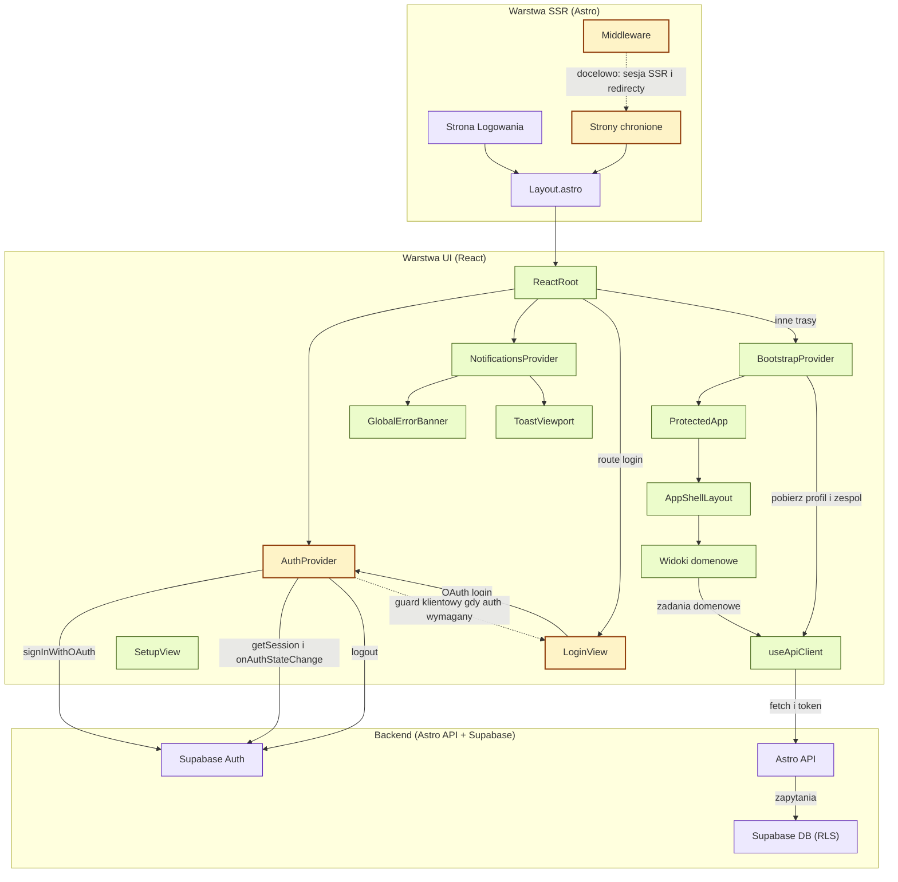

<architecture_analysis>
## Analiza architektury UI (logowanie i dostęp do aplikacji)

### 1) Komponenty i moduły występujące w dokumentacji i codebase

**Wymienione w specyfikacji auth (`.ai/auth-spec.md`):**
- `src/components/views/LoginView.tsx`
- `src/lib/auth/AuthProvider.tsx`
- `src/components/app/AppShellLayout.tsx`
- SSR redirecty na stronach Astro (public/protected)
- Middleware `src/middleware/index.ts` z Supabase po stronie serwera
- (docelowo) server-side Supabase client oparty o cookies
- `src/lib/http/api-client.ts` (dodawanie `Authorization: Bearer ...`)
- `src/lib/bootstrap/BootstrapProvider.tsx` (bootstrap profilu/zespołu)

**Rzeczywiście obecne w codebase (dodatkowo):**
- Strony Astro:
  - `src/pages/login.astro`
  - `src/pages/index.astro` (Generator)
  - `src/pages/members.astro` i pozostałe strony chronione
- Root React:
  - `src/components/app/ReactRoot.tsx`
- Notyfikacje i błędy:
  - `src/components/app/NotificationsProvider.tsx`
  - `src/components/app/GlobalErrorBanner.tsx`
  - `src/components/app/ToastViewport.tsx`
- Supabase klient:
  - `src/lib/auth/supabase.browser.ts` (browser)
  - `src/db/supabase.client.ts` (server / middleware + API)

### 2) Główne strony i odpowiadające komponenty

**Strony publiczne:**
- `/login` (`src/pages/login.astro`) → `ReactRoot(routeId="login")` → `LoginView`

**Strony chronione (wg PRD i auth-spec):**
- `/` (`src/pages/index.astro`) → `ReactRoot(routeId="generator")` → `ProtectedApp` → `AppShellLayout` + `GeneratorView`
- `/members` → `MembersView`
- `/unavailabilities` → `UnavailabilitiesView`
- `/plans` → `PlansListView`
- `/plans/:planId` → `PlanDetailView`
- `/stats` → `StatsView`
- `/setup` → `SetupView` (bootstrap po pierwszym logowaniu)

### 3) Przepływ danych między komponentami

- Wejście na stronę Astro → render SSR Layout → uruchomienie React (`ReactRoot`).
- `AuthProvider`:
  - Pobiera sesję (`supabase.auth.getSession`)
  - Subskrybuje zmiany (`onAuthStateChange`)
  - Jeśli `PUBLIC_AUTH_REQUIRED=true` i `status="anonymous"` → redirect klientowy do `/login`
- `LoginView`:
  - `loginWithOAuth("github")` → Supabase OAuth
  - Po zalogowaniu redirect klientowy do `/`
- `BootstrapProvider` (dla tras poza login):
  - Pobiera `/api/profile` i `/api/team`
  - Jeśli 404 → status `needsSetup` → redirect do `/setup`
  - Jeśli gotowe i jesteśmy na `/setup` → redirect do `/`
- `useApiClient`:
  - Dodaje `Authorization: Bearer <accessToken>` jeśli auth wymagany
  - Raportuje błędy do `NotificationsProvider` i wyświetla w `GlobalErrorBanner`

### 4) Krótki opis funkcjonalności kluczowych elementów

- `Layout.astro`: bazowy layout HTML i globalne style.
- `ReactRoot`: mapowanie `routeId` na widoki oraz kompozycja providerów.
- `AuthProvider`: stan auth + login/logout OAuth + client-guard.
- `LoginView`: ekran logowania przez OAuth (bez email/hasło w MVP).
- `BootstrapProvider`: po zalogowaniu ładuje profil i team; kieruje do `/setup`.
- `AppShellLayout`: top-nav + label użytkownika + Logout + kontener treści.
- `useApiClient`: wspólny klient HTTP z mapowaniem błędów i nagłówkiem auth.
- `middleware/index.ts`: dostarcza `context.locals.supabase` do endpointów API.

### Wyróżnienie zmian wynikających z nowych wymagań (auth-spec)

- Wymagane/oczekiwane: SSR redirecty na stronach `.astro` + sesja w middleware.
- W codebase: obecny jest client-guard, ale SSR redirecty i server-session są
  docelowo do wdrożenia (w diagramie oznaczone jako “do aktualizacji”).
</architecture_analysis>

<mermaid_diagram>

</mermaid_diagram>

